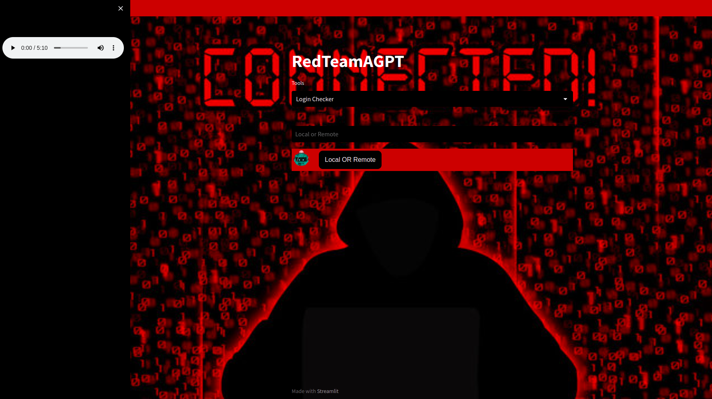

<h1 align="center">RedAGPT</h1>

<h2 align="center"> Cybersecurity AutoGPT Tool Kit </h2>

<p align="center" >
    
</p>

<h1 align="center"><b>⚠️🔴 NOT TO BE USED FOR ILLEGAL ACTIVITY 🔴⚠️</b></h1>

## About

RedAGPT is a toolkit designed to test network and other vulnerabilities for homes and offices. It uses cutting-edge technologies such as AutoGPT and Langchain to offer a highly efficient and effective security testing experience. The tool kit is designed with a focus on prompt engineering and seamless integration into security-focused Linux environments. This ensures that security professionals can easily use the tool kit to test for vulnerabilities in their networks and systems. 

The core technology used in the tool kit is AI, specifically AutoGPT using GPT-3 via the Langchain library. The AI runs a series of tests to detect vulnerabilities in the network and systems to then analyze the results of these tests and generate a comprehensive security report. This report details the vulnerabilities detected, their severity level, and recommendations on how to fix them. 

Overall, the tool kit is for security professionals looking for smarter security testing tools. Its use of AI and its ability to generate comprehensive reports makes it an essential tool for security professionals looking to keep their networks and systems secure.

## Development
* Engineering security tools through AutoGPT prompting
* Integration with streamlit chatbot
* Report generation
* Dynamic VectorStorage integration

## Coding Libraries Used
* LangChain
* AutoGPT experimental module via LangChain
* Redis vectorstorage module via LangChain

## Tech Used
* Redis Vector Storage 6.2.10
* Ubuntu (WSL) 22.04 LTS
* Kali Linux 6.1.0

## Tools
### LoginChecker
Utilizing [LangChain AutoGPT Documentation](https://github.com/hwchase17/langchain/blob/master/docs/use_cases/autonomous_agents/autogpt.ipynb) we created a set of [goals](https://github.com/shamantechnology/RedAGPT/blob/master/tools/login_checker.py#L65) for it to test the security of a login form on a website or IP.

Using these [goals](https://github.com/shamantechnology/RedAGPT/blob/master/tools/login_checker.py#L65) and declaring the type of [agent](https://github.com/shamantechnology/RedAGPT/blob/master/tools/login_checker.py#L126) to be, it runs command line tools like [Hydra](https://www.kali.org/tools/hydra/) and creates a form security test program in Python using the [selenium library](https://selenium-python.readthedocs.io/) and running it in REPL

At the end it will give us a security report of vulnerabilities found, if any, and give recommendations on how to fix.

## Future
* Later implementations we plan on allowing the user to task the AI to fix these issues.
* Work on a social engineering tool
* Embed in portable hardware like RespberryPI
* Further guardrail development
* Integration into Kali Linux
* Integration into Windows Powershell

## Development Setup

### Environment
You should create a virtualenv with the required dependencies by running
```
make virtualenv
```

Activate the virtualenv by running
```
source ./.venv/bin/activate
```

When a new requirement is needed you should add it to `unpinned_requirements.txt` and run
```
make update-requirements-txt
make virtualenv
```
this ensure that all requirements are pinned and work together for ensuring reproducibility

#### Make a copy of the example environment variables file
```
cp .env.example .env
```

#### Run the app
```
streamlit run chatbot.py | tail -n +6 > tools/logs/logtest04292023.txt
```

## Gallery

### Hackathon Demo Layout
<p align="center" >
    
</p>

### 1st Success
<p align="center" >
    
</p>
